<p align="center">

</p>

<h1 align="center"> Sistema de rede social - Funwitter</h1>

<p align="center">Este projeto é um sistema de rede social criado para a SA de programação de aplicativos.<br>Autor: Jonathan Sost Dos Santos</p>

## Pré-requisitos

É necessária uma IDE que rode Java (como [Eclipse](https://eclipseide.org) ou [IntelliJ IDEA](https://www.jetbrains.com/pt-br/idea/)) na versão JDK ou superior para rodar este programa.

## Como rodar

```bash
#Clone este repositório
$ git clone https://github.com/JonathanSostSantos/Sistema-de-Rede-Social

#Abra o projeto utilizando a IDE
```

## Features


- Menus interativos
- Login utilizando username e senha
- Criação, alteração e exclusão de usuários
- Diversas opções de interação com posts, sendo elas criar, editar, excluir, curtir, descurtir e comentar
- Opção de buscar usuários pelo nome
- Opções de adicionar ou remover amizades
- Visualização de feed que consta seus próprios posts e dos seus amigos

### Menu principal

Logo ao iniciar o programa, você se deparará com o menu principal do programa, que permite realizar o login de um usuário já existente ou a criação de um novo.

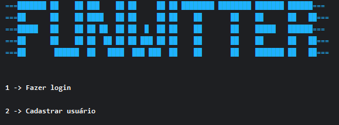

### Criação de usuário

Ao selecionar a opção de cadastro de usuário, o programa lhe pedirá as suas informações para cadastro, realizando algumas validações, sendo elas:
- O nome deve conter pelo menos 2 caracteres e deve ser composto apenas por letras e espaços
- O username não pode estar em uso por outro usuário e não pode ser vazio
- O email deve ser válido e não pode estar em uso por outro usuário
- A senha deve conter pelo menos 1 letra maiúscula, 1 letra minúscula, 1 número e conter pelo menos 6 caracteres

Caso as informações não contenham algum destes critérios, uma mensagem aparecerá explicando o que faltou.
Caso contrário, o sistema apresentará a mensagem "Usuário cadastrado com sucesso!"

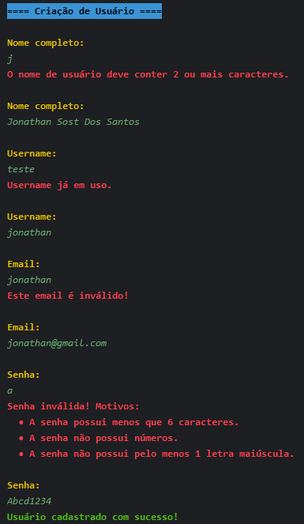

### Login no sistema

Voltando ao menu principal, caso você selecione a opção de logar no sistema, o mesmo irá te solicitar as informações da conta que você está tentando acessar.
Caso você informe um usuário inexistente ou uma senha incorreta, o sistema o avisará.
Caso contrário, o sistema apresentará a mensagem "Login efetuado!", assim como uma mensagem de boas-vindas e o menu de logado.

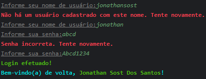

### Menu logado

Após realizar o login, o sistema lhe apresentará o menu de "logado", onde você se deparará com as seguintes opções:

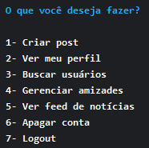

### Criar post

Quando você seleciona a opção de criar post, o sistema lhe pedirá para escrever o texto do seu post.
As validações do post são as seguintes:
- O post não pode ser vazio
- O limite de caracteres é 255

Caso o texto atinja esses critérios, o sistema apresentará a mensagem "Post publicado com sucesso!".

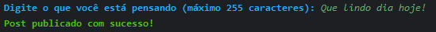

### Ver meu perfil

Retornando ao menu de logado, ao selecionar a opção ver meu perfil, seu nome completo irá aparecer suas informações, juntamente com outras opções:

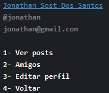

### Ver posts

Ao selecionar a opção ver posts, o sistema irá apresentar todos os posts do usuário que está logado, com sua contagem de curtidas e comentários, separando por páginas de até 10 posts.

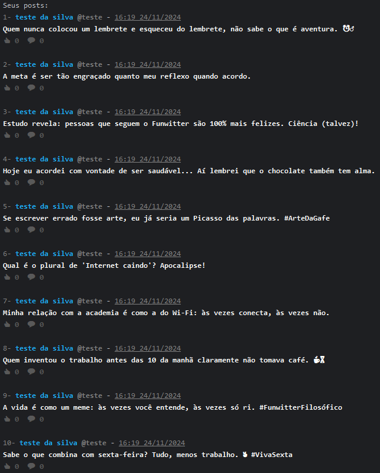

Nesta página, você tem algumas opções, como selecionar o número do post com o qual você deseja interagir, retornar digitando 0 ou navegar pelas páginas utilizando os seguintes comandos:
- '<' para retornar 1 página
- '<<' para retornar para a primeira página
- '>' para avançar 1 página
- '>>' para avançar até a última página

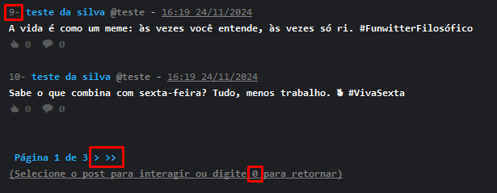

### Interações com posts

Ao selecionar um post para interagir, o post será destacado e as opções de interação serão destacadas.

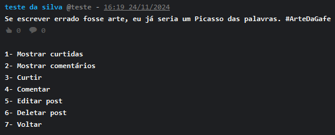

#### Mostrar curtidas

Ao selecionar a opção 1, serão apresentados os usuários que curtiram o post.

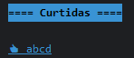

#### Mostrar comentários

Ao selecionar a opção 2, serão apresentados os usuários que comentaram o post, juntamente com seu comentário.

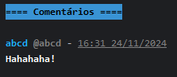

#### Curtir

Ao selecionar a opção 3, o usuário que está logado irá curtir o post selecionado.

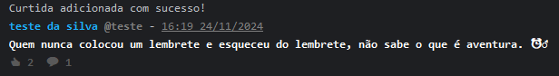

#### Comentar

Ao selecionar a opção 4, o usuário que está logado irá comentar no post selecionado.

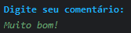

#### Editar post

Ao selecionar a opção 5, o usuário que está logado poderá editar o post. Caso a alteração aconteça, o sistema apresentará a mensagem "Post atualizado com sucesso!". Esta opção só será visível caso o usuário logado seja o autor do post.

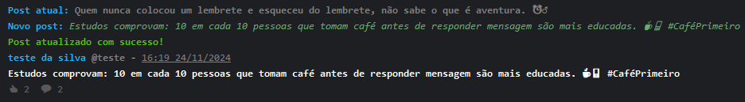

#### Deletar post

Ao selecionar a opção 6, o usuário que está logado irá deletar o post. Caso a exclusão aconteça, o sistema apresentará a mensagem "Post deletado com sucesso!".

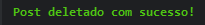

### Amigos

Retornando à página de perfil do usuário, ao selecionar a opção "amigos", o sistema irá listar todos os amigos do usuário, sendo possível remover a amizade por aí, selecionando o número ao lado do usuário.

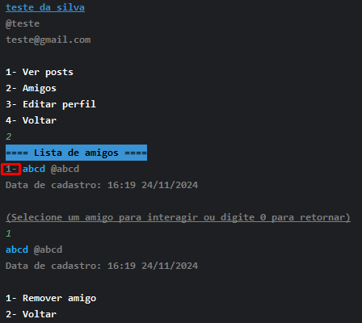

### Editar perfil

Ao selecionar a opção "editar perfil", o sistema irá lhe pedir novamente as mesmas informações solicitadas para o cadastro, realizando as mesmas validações.
Caso você não informe nada, a informação não será alterada.

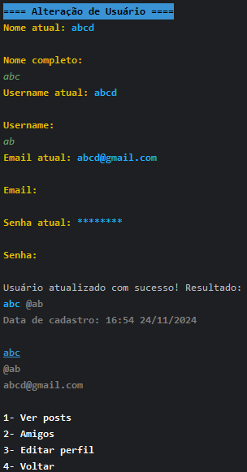

### Buscar usuários

Retornando ao menu de logado, caso você selecione a opção "buscar usuários", o sistema irá lhe solicitar o nome do usuário que você deseja buscar, e então apresentar os usuários que contiverem o valor digitado no nome. Você consegue também adicionar/remover amizades por esta tela.

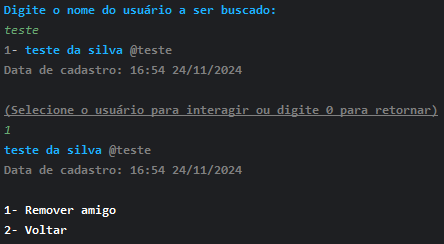

### Ver feed de notícias

Ao selecionar a opção "ver feed de notícias", o sistema irá apresentar todos os seus posts, juntamente com os dos seus amigos, ordenados do mais recente ao mais antigo. É possível interagir com os posts através desta página também.

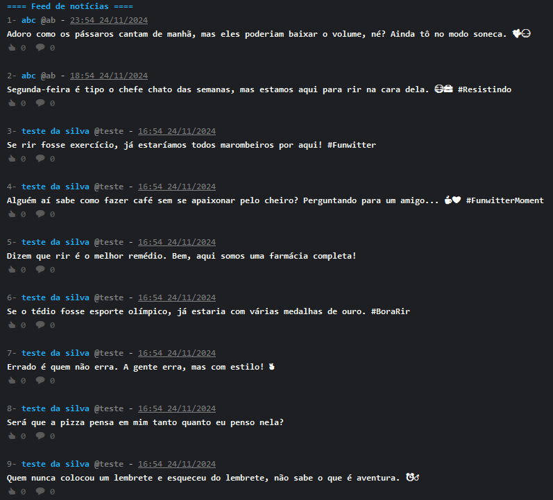

### Apagar conta

Ao selecionar a opção "apagar conta", você irá deletar permanentemente sua conta do sistema. Haverá uma mensagem de confirmação de exclusão, onde você deverá digitar S para confirmar ou N para cancelar. Caso você confirme a exclusão, o sistema apresentará a mensagem "Exclusão de conta realizada com sucesso!" e voltará para o menu principal.

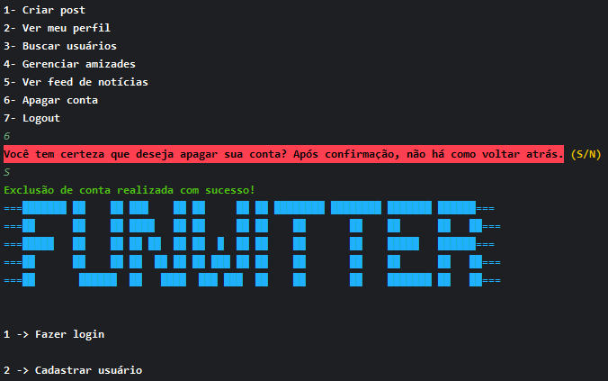

### Logout

Por último, mas não menos importante, há também a opção de realizar o logout do sistema e retornar ao menu principal.

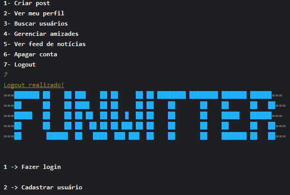